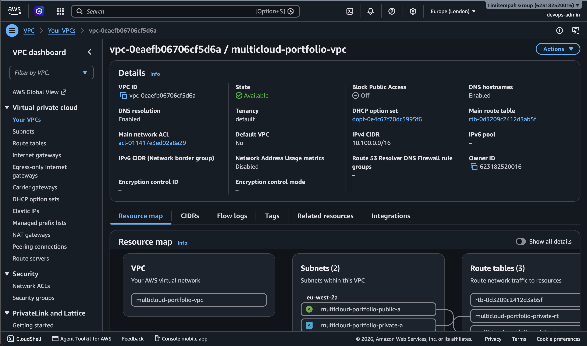
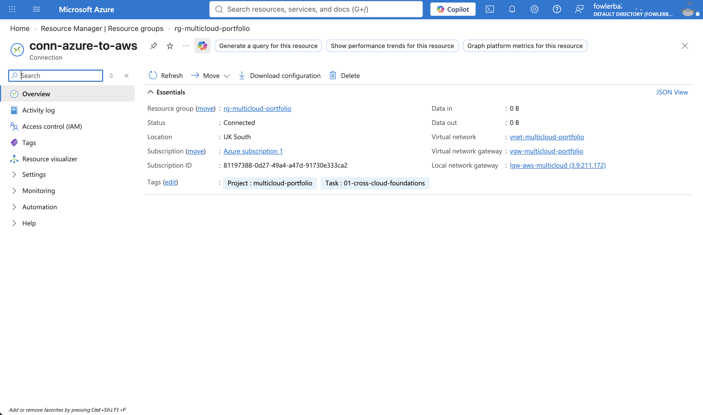
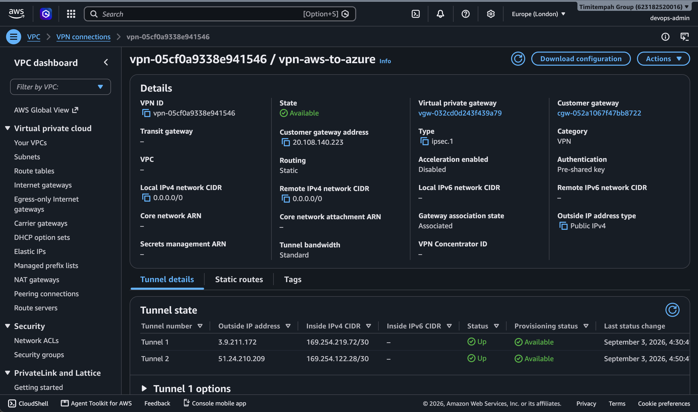
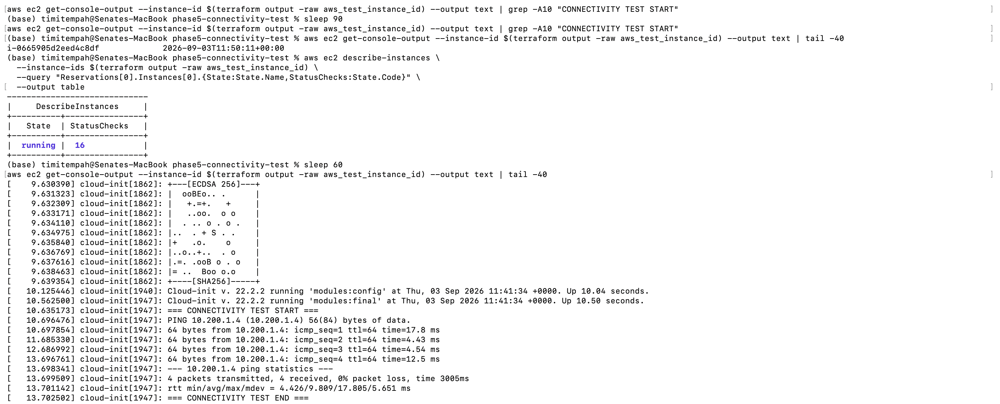

# Task 1: Cross-Cloud Foundations

A redundant, dual-tunnel Site-to-Site IPsec VPN connecting an AWS VPC to an Azure VNet, using static routing and both tunnels AWS provisions for high availability.

## Objective

Establish private, always-on connectivity between an AWS VPC and an Azure VNet, with no reliance on the public internet for traffic between the two networks. This connection underpins every later task in this portfolio.

## Architecture

- **AWS side:** VPC (`10.100.0.0/16`) with a public and private subnet, an Internet Gateway, route tables, and a Virtual Private Gateway.
- **Azure side:** VNet (`10.200.0.0/16`) with a reserved `GatewaySubnet`, a workload subnet, and a zone-redundant static public IP.
- **Connectivity:** a route-based IPsec VPN using static routing (not BGP), with both of AWS's redundant tunnel endpoints in active use -- each has its own Azure Local Network Gateway and Connection, since Azure has no single-resource equivalent of AWS bundling both tunnels into one VPN Connection.
- **Secrets:** the tunnel's pre-shared key is generated randomly and stored in AWS Secrets Manager, read by both AWS's and Azure's Terraform via a live lookup rather than hardcoded or duplicated anywhere.

## Build Sequence

Built in four phases, since AWS and Azure each need to know the other's address before their own side can be created:

1. **Phase 1** -- AWS VPC/subnets and Azure VNet/subnets/public IP (no gateway yet)
2. **Phase 2** -- Azure VPN Gateway (slow, 30-45 min to provision)
3. **Phase 3** -- AWS Customer Gateway + VPN Connection (built in parallel while Phase 2 provisions)
4. **Phase 4** -- Azure Local Network Gateway + Connection, for both AWS tunnel endpoints

## Design Decisions

**Static routing over BGP** -- the address ranges on both sides are fixed and known in advance, so BGP's dynamic route-learning wasn't needed. Static routing is simpler to configure and fully valid for this scale.

**Dual-tunnel HA** -- AWS provisions two tunnel endpoints per VPN Connection for redundancy. Achieving this on Azure's side required two separate Local Network Gateway + Connection pairs (one per AWS tunnel), both attached to the same underlying Azure VPN Gateway, since Azure has no concept of a single Connection covering multiple remote endpoints the way AWS does.

**Secrets Manager over hardcoded key** -- the pre-shared key is generated with `random_password` and stored in Secrets Manager rather than hardcoded in Terraform. Note this doesn't eliminate the key from Terraform state entirely (AWS's VPN Connection resource requires the raw value), but it does provide one centralized, access-controlled, auditable location for the key going forward, rather than a value duplicated across files.

## Screenshots

**AWS VPC overview** -- confirms the VPC, subnets, and route tables:

**Azure connection status** -- confirms the tunnel is genuinely connected, not just configured:

**AWS dual-tunnel status** -- both tunnels up, no "not highly available" warning:

**Connectivity proof** -- a real instance on each side, pinging across the tunnel:

## Connectivity Verification

A temporary EC2 instance and a temporary Azure VM were deployed (one in each network) purely to prove real traffic flows across the tunnel, not just that both consoles report "connected." The AWS instance ran a `ping` to the Azure VM's private IP automatically at boot via `user_data`, with the result read from the instance's console output.

Result: **4 packets transmitted, 4 received, 0% packet loss**, round-trip times between 4.4ms and 17.8ms. Both instances were destroyed immediately after the test.

One real issue was found and fixed during this test: the AWS public subnet's route table did not have the VPN route propagated to it (only the private route table did, per the original design, since real workloads were intended for the private subnet). The public subnet was only used because the test instance needed outbound internet access for tooling reasons (see Known Limitations below). This was fixed by adding a second `aws_vpn_gateway_route_propagation` resource targeting the public route table.

## Known Limitations

**SSM Session Manager registration failed.** The EC2 test instance's SSM Agent never registered with AWS Systems Manager, despite: a correctly attached IAM instance profile with `AmazonSSMManagedInstanceCore`, confirmed outbound internet access via an Internet Gateway route, and a security group allowing all outbound traffic. `aws ssm describe-instance-information` returned no results throughout testing, and the AWS Console's own connection diagnostics confirmed the agent had never contacted the SSM service. Root cause was not fully identified within the scope of this task -- the two remaining hypotheses (the AMI not shipping with a fully functional SSM Agent, or an endpoint reachability issue not visible from route tables/security groups) would require either AWS Systems Manager VPC Interface Endpoints or the EC2 Serial Console to properly diagnose, both of which were judged disproportionate to set up for a single disposable test instance.

**EC2 Instance Connect also failed**, both via direct SSH with a locally generated key and via the AWS Console's browser-based connect feature. IAM permissions for `ec2-instance-connect:SendSSHPublicKey` were confirmed present via `iam simulate-principal-policy`, and a security group rule permitting the AWS-managed EC2 Instance Connect IP prefix list was added and confirmed present -- the connection attempt still failed with a generic SSH error. This points toward the `ec2-instance-connect` helper package possibly being absent or misconfigured on this specific AMI build, though this could not be confirmed without an alternate way into the instance.

**Resolution:** rather than continuing to debug remote access tooling unrelated to the actual objective, the connectivity test was run automatically at instance boot via `user_data`, with results read from `aws ec2 get-console-output` -- a mechanism confirmed to work independently of both SSM and SSH. This is a valid, if more limited, way to verify a one-shot test: it provides boot-time output only, not an interactive session, and would not be suitable for anything beyond a single automated check.

If you've hit either of these two issues and found the actual root cause, this is a good place to compare notes.

## Teardown

The core VPN infrastructure (VPCs, VNet, both gateways, both tunnel connections) remains active, as it underpins Tasks 3, 4, and 5 of this portfolio. All temporary test resources (EC2 instance, Azure VM, and their supporting security groups/IAM roles) were destroyed immediately after the connectivity test completed.
