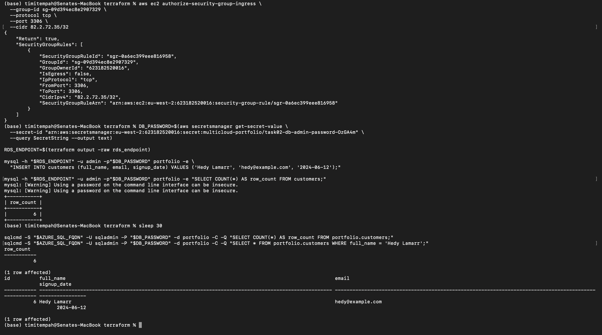
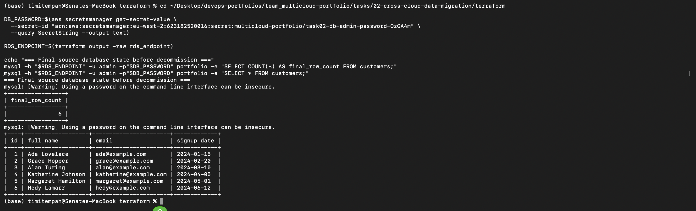

# Task 2: Cross-Cloud Data Migration

A real database migration from AWS RDS (MySQL) to Azure SQL Database, using AWS DMS for both the initial full-load copy and ongoing Change Data Capture (CDC), with a genuine cutover.

## Direction

**Source: AWS RDS (MySQL 8.0). Target: Azure SQL Database.** This is an AWS-to-Azure migration, not Azure-to-AWS.

## Migration Strategy: Replatform

Of the standard 6 Rs migration strategies (Rehost, Replatform, Refactor, Repurchase, Retire, Retain), this is a **Replatform**: the underlying database engine changes from MySQL to SQL Server -- a genuine platform shift involving real schema and data-type differences -- while the application-level data model doesn't require a rewrite.

## Architecture

- **Source:** a `db.t3.micro` MySQL 8.0 RDS instance, seeded with a small sample `customers` table (5 rows).
- **Target:** an Azure SQL Database (Basic tier) on a logical Azure SQL Server.
- **Migration tool:** AWS DMS, running `full-load-and-cdc` -- a one-time full copy followed by continuous replication of ongoing changes until the task is manually stopped.
- **Connectivity:** DMS reaches Azure SQL over its public endpoint directly, with temporary IP-scoped firewall rules on both sides for the replication instance and for direct seeding/verification access. **This task does not use the Site-to-Site VPN built in Task 1** -- both RDS and the DMS replication instance require public reachability regardless, so the VPN tunnel was not a dependency here.
- **Secrets:** the shared database admin password is generated randomly and stored in AWS Secrets Manager, read by both the AWS and Azure resources via a live lookup rather than hardcoded.

## Migration Sequence

1. Source RDS and target Azure SQL Database provisioned via Terraform.
2. Sample data seeded directly into the source (`customers` table, 5 rows).
3. DMS replication instance, source endpoint, and target endpoint created and connection-tested.
4. Full-load migration run and verified (row-for-row match on both sides).
5. CDC tested explicitly: a new row inserted directly on the source, confirmed to appear automatically on the target within 30 seconds, with no manual action taken on Azure.
6. Replication task stopped (cutover) -- from this point, Azure SQL is the standalone copy.
7. DMS infrastructure and the source RDS instance torn down; Azure SQL Database retained as the migrated target.

## Screenshots

**CDC replication proof** -- a new row inserted directly on the AWS source, confirmed present on the Azure target within 30 seconds with no manual action taken on Azure. This also confirms the full load succeeded, since CDC only activates once the initial full-load copy has completed:

**Final source state before decommission:**

## Issues Encountered

**RDS requires a DB Subnet Group spanning at least two Availability Zones**, even for a single-AZ instance. Task 1's VPC only had subnets in one AZ. Fixed by adding a second subnet in a different AZ.

**The second subnet initially used a private subnet, which broke public reachability.** RDS was configured `publicly_accessible = true`, but a private subnet has no route to the Internet Gateway, so the assigned public IP was unreachable despite existing. Fixed by adding a second *public* subnet in a different AZ instead, keeping both subnets in the group properly routed.

**AWS DMS requires a specific IAM role, `dms-vpc-role`, to exist before it can create any VPC-related DMS resources.** This role is normally created automatically by the DMS Console on first use; since this setup went straight to Terraform, the role didn't exist. Fixed by creating it explicitly in Terraform, making the setup reproducible without a prior manual console step.

**`dms.t3.micro` is not a valid DMS replication instance class** -- confirmed via `aws dms describe-orderable-replication-instances`. The smallest valid class is `dms.t3.small`.

**The initial migration task failed instantly with "Failed in resolving configuration."** Root cause: DMS requires the MySQL source to have binary logging enabled in `ROW` format for CDC, which RDS does not enable by default, and this in turn requires automated backups to be enabled (`backup_retention_period > 0`). Fixed with a custom DB parameter group setting `binlog_format = ROW`, combined with enabling backups, followed by an explicit instance reboot and an immediate (rather than next-maintenance-window) application of the backup retention change.

**Local IP changes mid-task required firewall rule updates on both clouds.** A residential internet connection's public IP is not static; both the RDS security group and the Azure SQL firewall needed a new rule added when direct verification access started failing partway through the task, despite nothing else having changed.

## Verification

- **Full load:** 5/5 rows migrated, verified as an exact match between source and target (names, emails, and dates).
- **CDC:** a sixth row inserted directly on the source appeared on the target within 30 seconds, with zero manual intervention on the Azure side -- genuine proof of live replication, not just a one-time copy.

## Teardown

All DMS resources (replication instance, both endpoints, subnet group, and task) and the source RDS instance (along with its supporting security group, subnet group, and parameter group) have been destroyed. The Azure SQL Database and Server remain, as they hold the migrated data. Temporary firewall rules added outside Terraform for direct verification access have also been removed.
