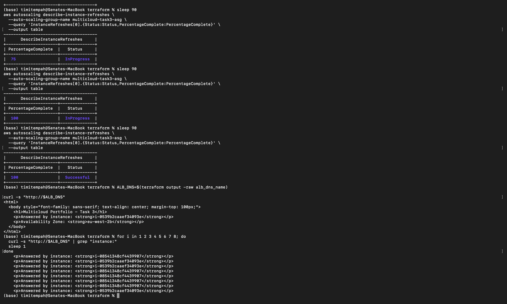
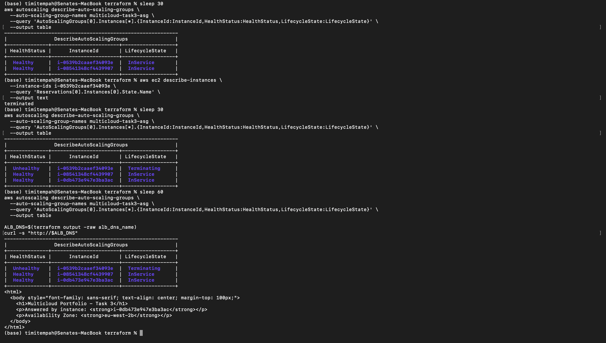

# Task 3: AWS-Side Workload

A self-healing, load-balanced web application on AWS -- an Application Load Balancer distributing traffic across an Auto Scaling Group of EC2 instances, deployed inside Task 1's VPC.

## Architecture

- **Application Load Balancer (ALB):** the public entry point, deployed across both public subnets (two Availability Zones) for its own availability.
- **Auto Scaling Group (ASG):** desired capacity of 2, min 2, max 4, deployed into the private subnets across both AZs. Instances are never directly internet-reachable -- only the ALB is public, and the instance security group only permits traffic from the ALB's security group.
- **Launch Template:** defines each new instance -- Amazon Linux 2023, `t3.micro`, with a boot script installing a minimal web server (`httpd`) that serves a page identifying which instance answered the request.
- **Target Group:** the ALB's list of valid instances, continuously updated by HTTP health checks (15-second interval, 2 consecutive checks to mark healthy or unhealthy).
- **S3 Gateway Endpoint:** a free VPC endpoint giving the private subnets direct access to Amazon Linux's package repositories (hosted on S3) without needing a NAT Gateway.

## Why an S3 Gateway Endpoint Instead of a NAT Gateway

The ASG's instances live in private subnets with no route to the internet, but `dnf install httpd` in the boot script needs to reach package repositories. Amazon Linux's repositories are hosted on S3, so rather than adding a NAT Gateway (a real, ongoing hourly cost) purely to let instances reach the internet for package installation, an S3 Gateway Endpoint provides a free, direct, private route to S3 specifically. This avoids unnecessary internet exposure for the instances and avoids an unnecessary recurring cost.

## Issues Encountered

**IMDSv2 token requirement.** The initial boot script queried the EC2 instance metadata service (`169.254.169.254`) without a token, which Amazon Linux 2023's default IMDSv2 requirement silently rejects -- returning empty responses rather than an error. This meant the served page displayed blank instance ID and Availability Zone fields, even though the web server itself was running correctly. Fixed by requesting a token first (`PUT /latest/api/token`) and including it in subsequent metadata requests. Since the two already-running instances had launched from the old template version, an ASG Instance Refresh was required to actually roll the fix out -- updating the launch template alone does not affect already-running instances.

## Verification

**Load balancing:** repeated requests to the ALB's DNS name showed two distinct instance IDs answering across a short sequence of calls, confirming traffic is genuinely distributed across the Auto Scaling Group rather than served by a single instance.

**Self-healing:** one instance was terminated directly and unannounced (not through the ASG), simulating a genuine, unplanned failure. The Auto Scaling Group's target-group-based health checks detected the loss, the ASG automatically launched a replacement instance to restore desired capacity, and the new instance was confirmed to be both healthy and actively serving real traffic through the ALB -- with no manual intervention beyond the initial termination.

## Screenshots

**Load balancing across instances:**

**Full self-healing lifecycle** -- instance terminated, detected as unhealthy, replaced automatically, and the replacement confirmed serving live traffic:

## Status

This workload remains live, alongside Task 4's Azure-side equivalent, pending a combined screenshot proving both cloud workloads are running simultaneously with Task 1's VPN tunnel still connected. Teardown of the VPN Gateway (both sides) is planned immediately after that evidence is captured, since neither this workload nor Task 4 depends on the tunnel being active.
