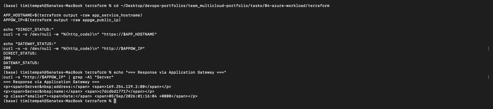
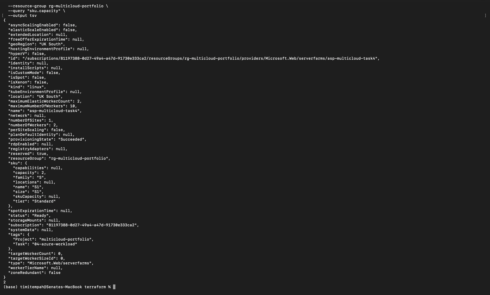
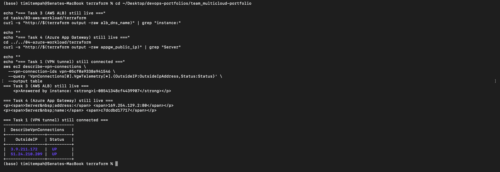

# Task 4: Azure-Side Workload

A load-balanced, scalable web application on Azure -- an Application Gateway routing traffic to an Azure App Service running on a Standard-tier App Service Plan with autoscaling configured, mirroring Task 3's AWS workload with Azure's managed-platform equivalent.

## Architecture

- **Application Gateway:** the public entry point, deployed into its own dedicated subnet (a requirement for Application Gateway -- it cannot share a subnet with other resource types).
- **App Service Plan (Standard S1):** hosts the application. Standard tier was required specifically because Basic tier does not support autoscale rules on App Service.
- **App Service (Linux, container-based):** runs the public `nginxdemos/hello` Docker image, which displays the responding container's hostname -- giving the same "which instance answered" proof pattern as Task 3's instance-ID page, with no custom image build required.
- **Autoscale setting:** configured for 1-3 instances, scaling out when average CPU exceeds 70 percent over a 5-minute window.
- **Backend routing:** the Application Gateway's backend pool points at the App Service's public hostname (FQDN) rather than using private VNet integration, keeping the networking simple for this task. The backend HTTP settings pick the hostname from the backend address automatically, since App Service validates the Host header strictly and will reject requests where it doesn't match.

## Compute Choice: App Service over VMSS

Task 3 demonstrated a self-managed VM fleet pattern (EC2 + Auto Scaling Group). Task 4 deliberately uses a managed-platform pattern (App Service) instead of mirroring that exactly with VMSS, to show two different, deliberate architectural approaches rather than repeating the same pattern on a different cloud. App Service also reflects how many real-world teams are actively moving away from managing raw VM fleets where a managed platform can do the same job with less operational overhead (patching, agent management, security hardening).

## Issues Encountered

**Deprecated default SSL policy.** Creating the Application Gateway initially failed with `ApplicationGatewayDeprecatedTlsVersionUsedInSslPolicy`. The Terraform provider's implicit default SSL policy (`AppGwSslPolicy20150501`) uses a TLS version Azure now rejects at creation time, even though this gateway has no HTTPS listener configured. Fixed by explicitly setting a modern predefined policy (`AppGwSslPolicy20220101S`).

## Verification

**Routing:** requests to both the App Service directly and through the Application Gateway returned identical content and a `200` status, confirming the gateway correctly routes to the backend.

**Scaling:** the App Service Plan was manually scaled from 1 to 2 workers and confirmed via the Azure CLI, proving the scaling mechanism works. (Autoscale rules are configured to trigger this automatically under real CPU load; a manual scale was used here as a direct, on-demand proof rather than waiting for organic load.)

**Cross-cloud combined check:** with Task 3's AWS workload, this task's Azure workload, and Task 1's VPN tunnel all verified live simultaneously -- confirming the full architecture functions as a coherent whole, not just as isolated tasks.

## Screenshots

**Application Gateway routing to App Service backend:**

**App Service Plan scaling from 1 to 2 workers:**

**All workloads live simultaneously, with Task 1's VPN tunnel still connected** -- captured immediately before VPN Gateway decommission:

## Teardown

This workload's Application Gateway (Standard_v2 SKU, a non-trivial ongoing cost) and the Standard-tier App Service Plan are scheduled for teardown immediately after this evidence is captured and committed, since neither is needed by any later task in this portfolio.
