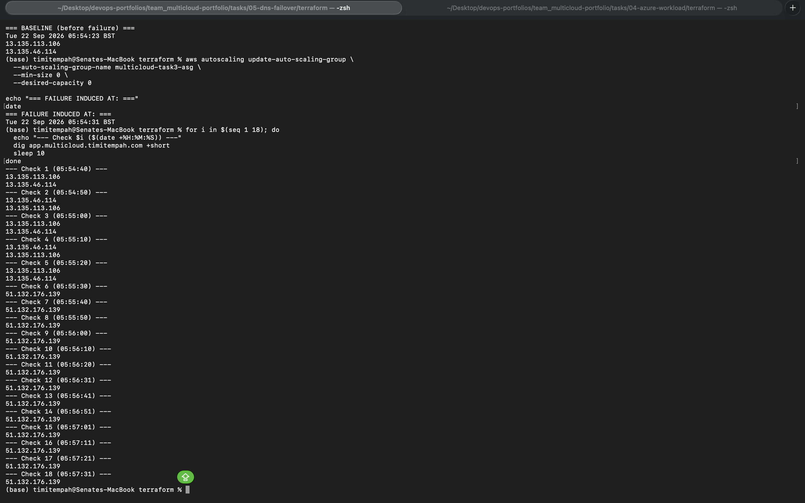
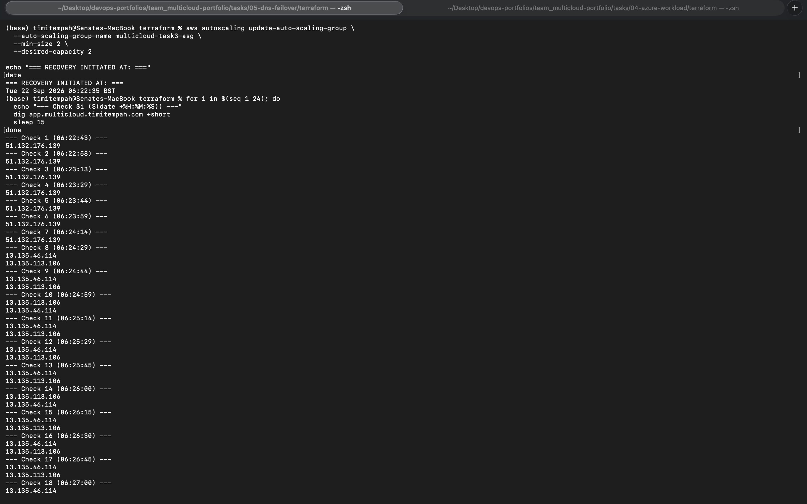
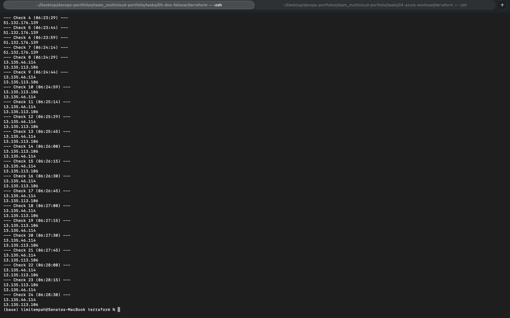

# Task 5: Global DNS Failover

Route 53 and Azure Traffic Manager both configured to route traffic to whichever cloud workload is healthy, with a real, timed, induced-failure test proving automatic failover and failback -- not just configured DNS records.

## Architecture

- **Domain:** a real, publicly delegated subdomain, `multicloud.timitempah.com`, not a placeholder or internal-only zone. NS records for this subdomain point from the parent domain's DNS provider (Cloudflare) to a dedicated Route 53 Hosted Zone, without touching any existing records (mail, SPF, DKIM) at the parent domain's root.
- **Route 53 failover routing:** `app.multicloud.timitempah.com` has a PRIMARY record (an Alias pointing at Task 3's AWS ALB) and a SECONDARY record (a plain A record pointing at Task 4's Azure Application Gateway IP), gated by an HTTP health check against the ALB (10-second interval, 2-check failure threshold).
- **Azure Traffic Manager:** a Priority-routing profile with the same two endpoints (AWS primary, Azure secondary), providing an independent, Azure-native failover mechanism alongside Route 53's.

## Design Decisions

**Real domain delegation over a fake `.internal` zone.** A publicly delegated subdomain means `app.multicloud.timitempah.com` genuinely resolves anywhere on the internet, not just when querying Route 53's nameservers directly -- a stronger, more realistic proof than a zone that only resolves in a contrived test.

**Priority routing on Traffic Manager, not Weighted.** This task is deliberately proving disaster-recovery failover behaviour (all traffic to one cloud until it fails, then all traffic to the other), not load distribution across both simultaneously.

## Issues Encountered

**Traffic Manager rejected mixed endpoint target types.** Azure Traffic Manager requires every external endpoint in one profile to use the same kind of target -- all domain names, or all IP addresses, never mixed. The AWS ALB's DNS name (a domain) and Azure's raw Application Gateway IP were rejected together. Fixed by adding a `domain_name_label` to the Application Gateway's public IP, giving it a proper Azure-issued FQDN to match the ALB's domain-name target.

**Route 53 rejected a CNAME and an A record at the same name.** This is a fundamental DNS specification rule, not a Route 53-specific restriction: a CNAME record cannot coexist with any other record type at the same name, even under a failover routing policy's different `set_identifier`s. Since the SECONDARY record (Azure) had to be a plain A record (pointing at an IP), the PRIMARY record (AWS) also had to resolve as type A -- fixed by using a Route 53 **Alias** record instead of a CNAME. Alias records are Route 53's mechanism for an A-type record that points at an AWS resource by name rather than a fixed address, and are the standard, recommended way to point Route 53 at an ALB in production regardless of this constraint.

## Verification

**Failover test.** Task 3's Auto Scaling Group was deliberately scaled to zero instances, leaving the ALB healthy but with no valid targets, causing it to return HTTP 503. Repeated, timestamped DNS queries against `app.multicloud.timitempah.com` showed:
- Failure induced at **05:54:31**
- Still resolving to AWS at **05:55:20**
- Switched to Azure's IP at **05:55:30**
- **Total failover time: approximately 59 seconds**, and stable on Azure for the remainder of the test.

**Failback test.** The Auto Scaling Group was restored to its normal capacity of 2. Repeated queries showed:
- Recovery initiated at **06:22:35**
- Still resolving to Azure at **06:24:14**
- Switched back to AWS at **06:24:29**
- **Total failback time: approximately 114 seconds** -- longer than the failover, because failback required genuinely new EC2 instances to launch, install their web server, and pass health checks from scratch, whereas the failover only had to detect an already-existing failure.

Both tests used no manual DNS changes at any point -- the switch and the switch-back were entirely automatic, driven by the health check and the failover routing policy.

## Screenshots

**Failover: AWS fails, Azure takes over automatically:**

**Failback: AWS recovers, traffic returns automatically** (split across two screenshots covering the full sequence):

## Teardown

Task 4's Application Gateway and App Service (brought back up specifically to give this test a genuine second live endpoint) are scheduled for teardown immediately after this evidence is captured and committed, consistent with this portfolio's practice of not leaving high-cost resources running once their evidence is captured.
