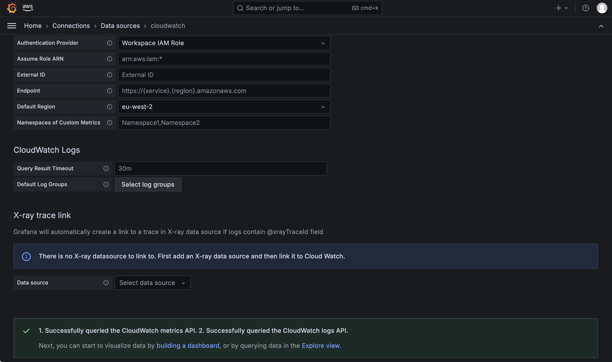
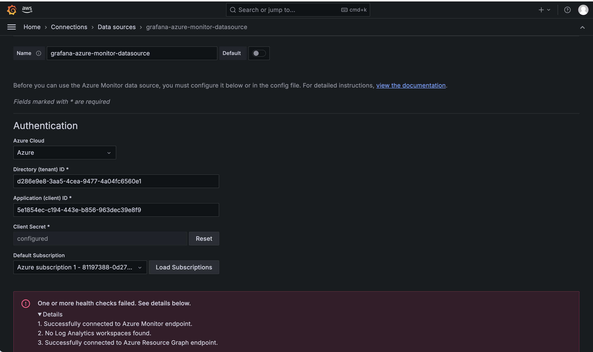
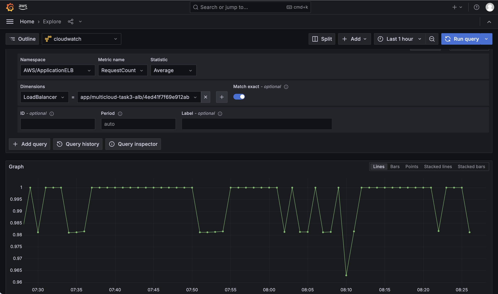
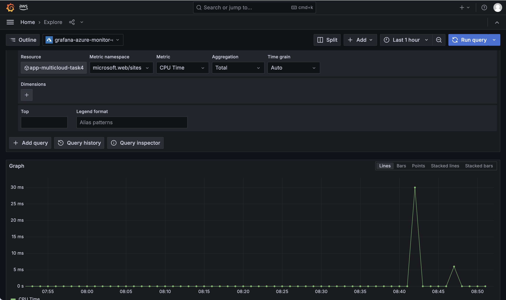

# Task 6: Unified Monitoring with Grafana

Amazon Managed Grafana connected to both CloudWatch and Azure Monitor as data sources, proving genuine cross-cloud observability from a single tool rather than two separate dashboards.

## Architecture

- **Amazon Managed Grafana workspace**, authenticated via AWS IAM Identity Center, with a dedicated IAM role (`CloudWatchReadOnlyAccess`) attached for the CloudWatch data source.
- **CloudWatch data source**, using the workspace's own IAM role for authentication -- no credentials stored in Grafana itself.
- **Azure Monitor data source**, authenticated via a dedicated Azure AD app registration, scoped only to the `rg-multicloud-portfolio` resource group -- not the whole subscription.

## Permission Model

**AWS side:** the Grafana workspace's IAM role carries `CloudWatchReadOnlyAccess`, attached directly by Terraform before the workspace even existed. No manual credential entry was needed in Grafana -- selecting "Workspace IAM Role" as the authentication provider was sufficient.

**Azure side:** a dedicated app registration (`grafana-azure-monitor`) was granted two roles, both scoped only to the project's resource group:
- **Monitoring Reader** -- read access to metrics, alerts, and diagnostic settings.
- **Reader** -- general resource-listing access, required separately because Grafana's resource picker needs to enumerate what exists in the resource group before a specific resource can be queried; Monitoring Reader alone does not include this.

## Issues Encountered

**IAM Identity Center's default "Multi-Region instance" setup would have added unnecessary cost.** The default option adds a second AWS region and a customer-managed KMS key, the latter explicitly flagged as incurring extra charges. Fixed by choosing "Custom instance" instead, with a single region and the free AWS-owned key.

**IAM Identity Center commands require an explicit region.** `aws sso-admin list-instances` returned empty until `--region us-east-1` was specified -- Identity Center was created in `us-east-1` (its recommended primary region), while this account's CLI otherwise defaults to `eu-west-2`. Any future CLI command touching Identity Center needs the same explicit region.

**The build guide's role name was incorrect.** `az role assignment create --role "Monitor Reader"` failed with `Role 'Monitor Reader' doesn't exist`. The correct built-in Azure role name is **"Monitoring Reader"**.

**"Monitoring Reader" alone was not sufficient for Grafana's resource picker.** Even with a successful data source connection test, Grafana's Azure Monitor "Select a resource" dialog failed with "Unable to resolve a list of valid metric namespaces," because Monitoring Reader only covers monitoring-specific read actions, not general resource enumeration. Fixed by additionally granting the general **Reader** role, still scoped to the same resource group only.

**Azure Resource Graph indexing lag.** Even after both roles were correctly confirmed via `az role assignment list`, the resource picker still could not find a freshly-created App Service by search. This pointed to Azure Resource Graph (the index the picker searches) lagging slightly behind the resource's actual provisioning state. Worked around by using the picker's "Advanced" mode to specify the resource directly by subscription, namespace (`Microsoft.Web/sites`), region, resource group, and name, rather than relying on search.

**A "successful" apply had not actually run.** Partway through troubleshooting the resource picker, `az webapp show` returned `ResourceNotFound` for the App Service being queried -- `terraform state list` confirmed the earlier targeted apply had never actually executed, despite proceeding as if it had. Caught by checking actual state directly rather than assuming a previous step had succeeded, and re-run cleanly from there.

## Verification

**CloudWatch:** a live Explore query against `AWS/ApplicationELB`'s `RequestCount` metric, filtered to Task 3's ALB, returned real, fluctuating data points reflecting actual traffic.

**Azure Monitor:** a live Explore query against the redeployed `app-multicloud-task4` App Service's `CPU Time` metric returned real data points, including visible activity spikes.

## Screenshots

**CloudWatch data source connection test:**

**Azure Monitor data source connection test:**

**Live CloudWatch query -- real ALB traffic data:**

**Live Azure Monitor query -- real App Service CPU data:**

## Teardown

The App Service redeployed specifically to provide a live, queryable Azure Monitor resource has been torn down. The Grafana workspace itself remains live, since Task 7's cross-cloud dashboard is built inside this same workspace.
