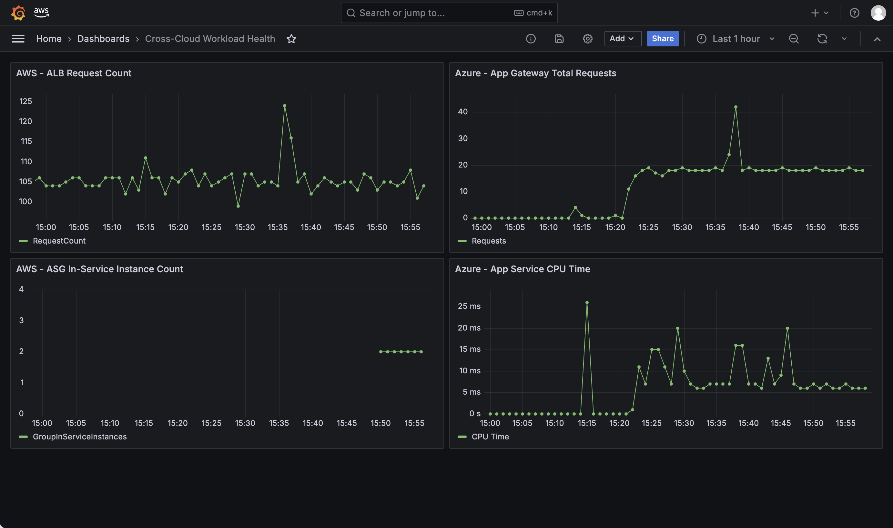
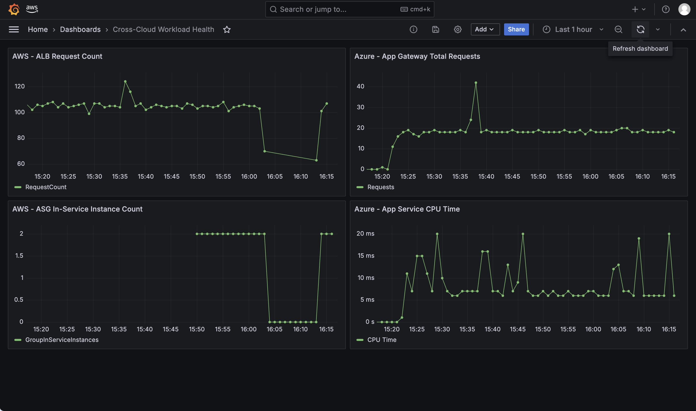

# Task 7: The Cross-Cloud Dashboard

One Grafana dashboard, both clouds' workload health side by side -- built inside the same workspace configured in Task 6, and captured live during a re-run of Task 5's induced-failure test.

## Architecture

Four panels in a 2x2 layout:
- **AWS - ALB Request Count** (top-left) -- Task 3's ALB, `AWS/ApplicationELB` / `RequestCount`
- **Azure - App Gateway Total Requests** (top-right) -- Task 4's Application Gateway, `Total Requests`
- **AWS - ASG In-Service Instance Count** (bottom-left) -- Task 3's Auto Scaling Group, `AWS/AutoScaling` / `GroupInServiceInstances`
- **Azure - App Service CPU Time** (bottom-right) -- Task 4's App Service, `CPU Time`

Request-volume panels on top, capacity/compute panels underneath, AWS on the left and Azure on the right -- matched pairs across both clouds.

## Design Note: App Service CPU Time, Not VMSS CPU Percentage

The original panel plan referenced VMSS CPU Percentage. Task 4 was deliberately built with App Service rather than VMSS (a conscious architectural choice made at the time, to demonstrate a managed-platform pattern rather than repeating Task 3's self-managed VM fleet pattern on Azure). This dashboard's Azure compute panel uses App Service's own `CPU Time` metric instead, consistent with what was actually built.

## Issues Encountered

**The hand-written dashboard JSON imported successfully but rendered no data on any panel.** `curl`-based import via the Grafana API reported success, and the panel titles, layout, and data source assignments all appeared correct, but every panel showed "No data." Grafana's real internal query schema for CloudWatch and Azure Monitor panels is more specific than the simplified example structure used to hand-write the JSON, so the query fields never actually populated correctly despite looking right in the JSON file. Fixed by re-entering each panel's query manually through Grafana's own panel editor (Region, Namespace, Metric, Dimensions/Resource), using the exact values already proven to work in Task 6's Explore view, then saving -- letting Grafana generate its own correct internal query structure rather than hand-writing it.

**AWS Auto Scaling Groups do not publish group-level CloudWatch metrics by default.** Even with the panel query correctly configured, `GroupInServiceInstances` returned no data. This is not a query or permissions problem -- ASGs simply do not publish metrics like `GroupInServiceInstances` to CloudWatch unless metrics collection is explicitly enabled. Fixed with `aws autoscaling enable-metrics-collection --granularity 1Minute`. This only affects data going forward from when it's enabled; no historical backfill is possible.

**Request-volume panels initially showed no data due to lack of recent traffic**, not a configuration fault -- `RequestCount` and `Total Requests` metrics only report data points when actual requests occur. Resolved by generating real traffic against both the AWS ALB and Azure Application Gateway directly, then waiting for metric ingestion (roughly 1-5 minutes) before re-querying.

## Verification

**All four panels confirmed rendering live data** simultaneously, pulling from two genuinely separate cloud accounts through one unified interface.

**Failover re-test**: Task 3's Auto Scaling Group was scaled to zero, inducing the same failure as Task 5's original test, this time with the dashboard open and actively refreshing. Both AWS panels show a clean drop to zero, held for the duration of the outage, then a clear recovery back to normal levels once the ASG was restored -- while both Azure panels remained completely steady and unaffected throughout the entire AWS outage window. See Task 5's README for the underlying DNS failover timing this dashboard is visualising.

## Screenshots

**Full dashboard, all four panels live:**

**Captured during the failover re-test** -- AWS panels drop and recover, Azure panels unaffected throughout:

## Artifacts

- `dashboard.json` -- the original hand-written dashboard definition (kept for reference, though its query structure did not render data as-is -- see Issues Encountered)
- `dashboard-export.json` -- the actual, working dashboard exported live from Grafana after manual panel configuration, with real data source UIDs and correct internal query structure

## Teardown

No new infrastructure was created in this task beyond the dashboard itself. Task 4's Application Gateway and App Service, redeployed to give this dashboard live data to query, are scheduled for teardown once this evidence is committed. The Grafana workspace remains live for now.
