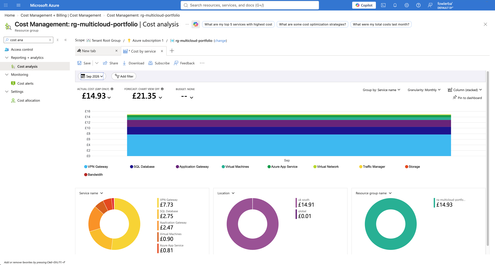

# Task 8: Cost Visibility Across Both Clouds

Combined AWS and Azure spend for this project in a single view, sourced from each cloud's own cost management tooling.

## Approach

**AWS.** All resources were tagged `Project=multicloud-portfolio` from the start, intended to allow a tag-filtered Cost Explorer query isolating this project's spend specifically.

**Azure.** All resources lived inside a single resource group (`rg-multicloud-portfolio`), allowing Cost Management to be scoped directly by resource group rather than needing a tag at all.

## Issues Encountered

**AWS cost allocation tags are not retroactive.** The `Project` tag was activated in Billing settings partway through this task, expecting the standard "up to 24 hours to populate" delay before it would return filtered data. In practice, the tag-filtered query never returned meaningful historical data at all, even after waiting -- because cost allocation tags only attribute cost **from the moment of activation forward**, not retroactively across a resource's actual lifetime. Since the tag was activated only hours before Task 9's full teardown, the tag-filtered query could only ever see a few cents of the final sliver of activity, not the roughly three weeks of real usage that came before it.

**Fixed by using the full, account-wide Cost Explorer breakdown instead** (`aws ce get-cost-and-usage` with no tag filter, grouped by service), cross-referenced against the actual AWS bill reviewed earlier in this project. Every single non-zero service in the account-wide breakdown -- EC2, Elastic Load Balancing, RDS, DMS, VPC, Route 53, Secrets Manager, plus small Terraform-state-backend and Cost Explorer API charges -- matches this project's own known resource types and build history exactly, with no unexpected services appearing that would suggest other, unrelated activity in the same period. This gives high confidence the account-wide total genuinely reflects this project's cost, even without tag-level attribution.

**The lesson for future projects:** activate cost allocation tags on day one, not partway through -- or, if using a shared or general-purpose AWS account, budget the time to confirm tag activation status before relying on it for a project's entire cost history.

## Cost Summary (September 2026, pre-tax)

| Cloud | Amount | Source |
|-------|--------|--------|
| AWS | $40.09 | Account-wide Cost Explorer breakdown, cross-referenced against the actual bill |
| Azure | $18.96 (£14.93 converted at ~1.27) | Cost Management, scoped to `rg-multicloud-portfolio` |
| **Combined** | **$59.05** | |

Tax is excluded from these figures for a like-for-like comparison; AWS's own tax for this period was a further $8.02, itemized separately on the account bill.

## Screenshots

**Azure Cost Management report, scoped to the resource group:**

## Artifacts

- `combine_costs.py` -- generates the combined cost chart from both clouds' totals
- `reports/cost-summary.png` -- the resulting chart

## AWS Evidence

Since the AWS total is sourced from a plain account-wide Cost Explorer query rather than a screenshot, the same evidence takes the form of command output -- see this task's README above for the exact command and full itemized breakdown used to arrive at the $40.09 figure.
