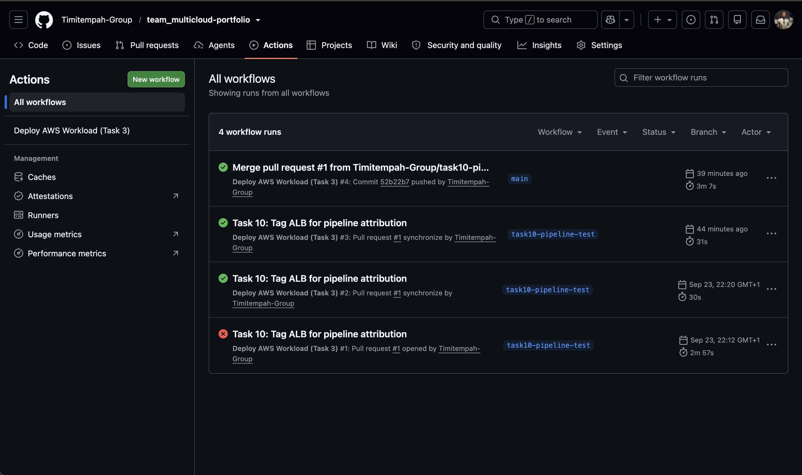
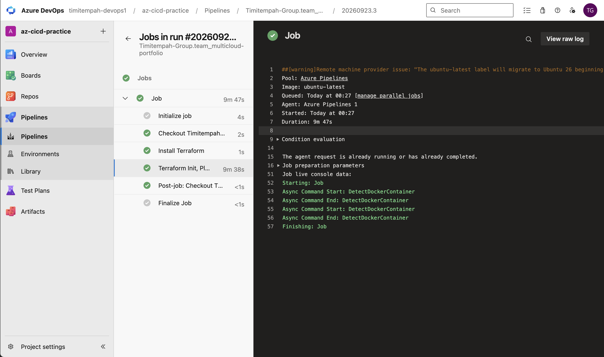

# Task 10: Cross-Cloud CI/CD

Two real, working CI/CD pipelines -- GitHub Actions for AWS, Azure Pipelines for Azure -- each authenticating without long-lived stored credentials, running a genuine plan-then-review-then-apply cycle, and deploying real infrastructure from a completely empty account (the state Task 9's close-out left behind).

## Why This Task Exists

Task 9 proved the portfolio could be completely, verifiably torn down. This task proves the opposite half of the same discipline: that it can also be brought back up entirely through automation, with no manual `terraform apply` from a terminal, and with a real review gate between "someone proposed a change" and "that change touched real infrastructure."

## Architecture

**AWS side -- GitHub Actions:**
- Authenticates via OIDC federation to a dedicated IAM role, scoped to exactly this repository and to only the AWS services Task 3 needs (EC2/ELB/ASG) plus the Terraform state backend -- not blanket `AdministratorAccess` like the human `devops-admin` user.
- `terraform plan` runs and posts its full output as a comment on the pull request whenever Task 3's Terraform changes.
- `terraform apply` runs only once that PR is merged to `main`.

**Azure side -- Azure Pipelines:**
- Authenticates via Workload Identity Federation (Azure DevOps's automatic, secretless service connection type) to the same Azure subscription.
- Mirrors the same plan-on-PR, apply-on-merge structure for Task 4's Terraform.

## Issues Encountered

**A pre-existing GitHub OIDC provider already existed in the AWS account.** OIDC providers are account-wide singletons keyed by issuer URL, shared across every repo and role that trusts them -- likely created earlier by one of this account's other portfolios. Fixed by referencing the existing provider via a Terraform data source rather than trying to create a duplicate.

**The actual GitHub OIDC subject claim did not match the standard format.** `sts:AssumeRoleWithWebIdentity` was denied even with a seemingly correct trust policy. Printing the token's actual claims (via a temporary debug step) revealed this GitHub organization has OIDC subject-claim customization enabled, appending numeric organization and repository IDs to the claim (`repo:ORG@id/REPO@id:...`) rather than the plain `repo:ORG/REPO:...` format most documentation assumes. Fixed by adjusting the trust policy's wildcard pattern to match the actual format, discovered by inspecting real data rather than guessing.

**Task 3's pipeline failed because Task 1's foundational networking no longer existed.** Task 9's teardown had genuinely destroyed the VPC/VNet Task 3 depends on via remote state. This wasn't a pipeline bug -- it's a real architectural question: foundational, shared networking is a platform-layer concern, not something an individual workload's deployment pipeline should provision itself. Resolved by treating Task 1's networking as a one-time bootstrap prerequisite (the same category as the Terraform state backend and the OIDC provider itself), redeployed once directly, after which the pipeline succeeded normally.

**Azure Pipelines' hosted agents do not have Terraform pre-installed**, unlike GitHub's runners. Fixed by adding an explicit install step (downloading the Terraform binary directly) before the Terraform steps run.

**Terraform's S3 state backend requires AWS credentials, regardless of which cloud a task's actual resources live in.** The Azure Pipeline authenticated correctly to Azure but had no way to reach the shared state backend in AWS. Given a real time constraint (an Azure trial's credits expiring within hours), the pragmatic fix was a dedicated IAM user with access keys scoped to only the state bucket and lock table -- a genuine, acknowledged trade-off against this project's general preference for OIDC over long-lived credentials, made consciously rather than silently, and narrowly scoped rather than reusing any broader credential.

**A secret access key was accidentally pasted in plain text during setup.** Caught immediately; the exposed key was deleted and a fresh one generated before use, rather than proceeding with a credential that had already been exposed.

## Verification

**AWS:** a pull request touching Task 3's Terraform triggered a real plan, posted in full as a PR comment ("Plan: 8 to add"). Merging it triggered a real apply, confirmed by checking the actual AWS account afterward -- the ALB, ASG, and supporting resources genuinely existed, created entirely by the pipeline.

**Azure:** a push to `main` triggered the Azure Pipeline, which ran Terraform end-to-end (9 minutes 47 seconds, consistent with the Application Gateway's known provisioning time) and genuinely created Task 4's App Service, Service Plan, autoscale setting, Application Gateway, and its public IP -- confirmed directly against the Azure account, and by a live `curl` returning `200` through the pipeline-deployed Application Gateway.

## Screenshots

**GitHub Actions -- successful AWS deployment via merged pull request:**

**Azure Pipelines -- successful Azure deployment, all steps green:**

## Teardown

Both pipelines' deployed infrastructure (Task 3's ALB/ASG, Task 4's Application Gateway/App Service) were torn down immediately after this evidence was captured and verified, consistent with this portfolio's discipline throughout -- and with particular urgency here, given the Azure trial credits used for this task were nearing expiry.
